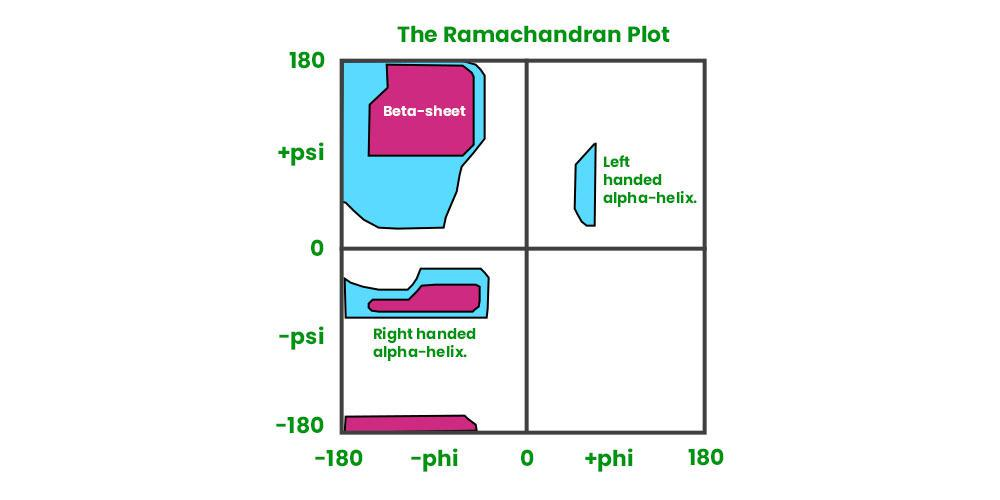

# Metrics - Geometric

## RMSD

> PockeXMol

RMSD的计算：均可以用RDKit或Biopython实现

### All-atom RMSD

计算范围：全原子

计算要求：两条序列的长度相同，氨基酸序列相同（所有原子都能对应）

计算方法：比较所有原子的坐标

应用场景：Docking

实现方法：`PocketXMol/evaluate/utils_eval.py`中的`evaluate_rmsd_df`函数

### Ca RMSD - TA / BA

计算范围：Cα（骨架原子）

计算要求：两条序列的长度相同（所有的Cα都能对应）

计算方法：比较Cα的坐标；TA: target-align (pocket对齐，默认)；BA: binder-align (peptide对齐)

应用场景：Docking，De novo design，（Inverse-Folding固定骨架原子，因此Cα RMSD为0）

实现方法：`PocketXMol/evaluate/calc_peptide_ca_rmsd.py`

### Backbone RMSD

计算范围：氨基酸的骨架原子，例如N-C-C=O，包括N、Cα、C、O

计算要求：两条序列的长度相同（所有的骨架原子都能对应）

计算方法：比较骨架原子的坐标

应用场景：Docking，De novo design，（Inverse-Folding固定骨架原子，因此Backbone RMSD为0）

实现方法：`PocketXMol/evaluate/evaluate_pepfull.py`

### Side-chain RMSD

计算范围：氨基酸的侧链原子（去除骨架）

计算要求：两条序列的长度相同

计算方法：比较侧链原子的坐标。只有residue的name和index均相同，才会进行计算，并且只计算该residue中共有的原子，因为Inverse-Folding可能缺失部分原子。

应用场景：Inverse-Folding

实现方法：`PocketXMol/evaluate/evaluate_pepsc.py`

### Self-consistency

应用场景：De novo design

计算方法：输入生成的Peptide序列，使用AlphaFold3预测其结构，计算AlphaFold3预测的Peptide结构与模型生成的Peptide结构之间的Ca RMSD

参考方法

- CPSea
  - We evaluated the self-consistency between sequences and structures of cyclic peptides by calculating **RMSD** between structures in CPSea and structures predicted by HighFold2 based on sequences (which is termed scRMSD). Because it is difficult to predict structures of isopeptide cyclic peptides (Appendix A.2), we only evaluated mainchain and disulfide peptides. We randomly selected 10,000 structures from each type, and reported the average scRMSD. 
  - **CA-RMSD:** 与我们在Peptide Docking中的评估方法相同（**查阅了CPSea的代码**）
- SurFlow
  - **Designability** (consistency between designed sequences and structures): the fraction of sequences that can fold into structures similar to their corresponding generated forms, with 𝐶𝛼 RMSD < 2 Å as the threshold. Use ESMFold.

## TM-score

TM-score vs RMSD

- 标准 TM-score 是基于 $$C\alpha$$ 原子的坐标进行计算的
- TM-score 的设计初衷是为了评估**拓扑结构的相似性**，因此它忽略了侧链的复杂性，只关注主链骨架。
- 与 RMSD 不同，TM-score 对局部偏差不敏感，更适合评估蛋白质的拓扑相似性

TM-score 的计算公式如下：

$$TM\text{-score} = \frac{1}{L_{\text{target}}} \sum_{i=1}^{L_{\text{aligned}}} \frac{1}{1 + \left( \frac{d_i}{d_0(L_{\text{target}})} \right)^2}$$

其中：

- $$L_{\text{target}}$$ 是目标蛋白的长度。
- $$d_i$$ 是第 $$i$$对残基之间的距离。
- $$d_0$$ 是一个随长度变化的归一化因子，计算公式通常为 $$d_0(L) = 1.24 \sqrt[3]{L-15} - 1.$$。

**归一化长度**

- TM-align 会输出两个 TM-score 值，分别以结构 1 和结构 2 的长度归一化
- 在评估预测质量时，通常以 **天然结构 (Native/Ground Truth)** 的长度为基准

应用场景：Docking，De novo design，（Inverse-Folding固定骨架原子，因此TM-score为1）

实现方法：`PocketXMol/evaluate/calc_peptide_tmscore.py`

## DockQ

### 计算公式

DockQ计算方法：DockQ是一个综合指标（0到1），结合了 $$F_{nat}$$（接触频率）、$$LRM$$（配体RMSD）和 $$iRM$$（界面RMSD）

DockQ 由以下三个关键参数加权融合而成：

- $$F_{nat}$$ (Fraction of Native Contacts)
  - **定义**：预测模型中保留的原生接触（Native Contacts）比例。
  - **计算**：如果预测模型中某对残基的距离在 $$5\text{Å}$$ 以内，且该对残基在天然结构中也处于界面接触状态，则计为一个有效接触。
  - **意义**：衡量界面结合模式的准确性。
  - **公式**：$$F_{nat} = \frac{\text{模型中正确预测的接触对数}}{\text{真实结构中的总接触对数}}$$
- $$iRM$$ (Interface RMSD)
  - **定义**：界面残基的均方根偏差。
  - **计算**：首先识别出真实结构中处于界面上的残基（通常指距离对方链 $$10 \text{Å}$$ 以内的残基）。将模型预测结果与真实的界面残基进行对齐后计算**主链原子的RMSD**。
  - **意义**：反映结合界面的局部精确度。
- $$LRM$$ (Ligand RMSD)
  - **定义**：配体（通常指较短的链）在受体对齐后的均方根偏差。
  - **计算**：先将预测模型与参考结构的受体（Receptor）部分进行重叠对齐，然后计算配体（Ligand）**主链原子的 RMSD**。（类似前面提到的Backbone RMSD或Ca RMSD - TA）
  - **公式转换**：为了整合进 0-1 的分值，使用 $$RMSD_{scaled} = \frac{1}{1 + (\frac{RMSD}{d_L})^2}$$ 进行非线性映射。

DockQ的最终得分是上述指标的平均值（经过非线性缩放）

$$DockQ = \frac{1}{3} \left( F_{nat} + \frac{1}{1 + (\frac{iRMS}{d_{i}})^2} + \frac{1}{1 + (\frac{LRMS}{d_{L}})^2} \right)$$

- 为了使不同数量级的 RMSD 能够与 $$F_{nat$$ 合并，DockQ 将 RMSD 转换为 0-1 之间的得分
- 其中，$$d_{i$$ 和 $$d_{L$$ 是经验常数（缩放因子）
  - $$d_{i} = 1.5 \text{Å}$$
  - $$d_{L} = 8.5 \text{Å}$$
- 这种转换确保了当 RMSD 很大时，该项得分趋近于 0；当 RMSD 为 0 时，该项得分为 1。

$$d_{i$$ 和 $$d_{L$$ 这两个常数是基于 CAPRI 分级标准拟合得到的，确保了 DockQ 分值与传统评价等级CAPRI的高度对应。

### 评估标准

**DockQ输出的log**

Statistics on CAPRI data                    

- 0.00 ≤ DockQ <  0.23 - Incorrect
- 0.23 ≤ DockQ <  0.49 - Acceptable quality
- 0.49 ≤ DockQ <  0.80 - Medium quality
- ​            DockQ ≥ 0.80 - High quality

Definition of contact <5Å (Fnat)

Definition of interface <10Å all heavy atoms (iRMS) 

**Gemini**

| 指标     | 优秀 (High) | 接受 (Acceptable) | 失败 (Incorrect) |
| -------- | ----------- | ----------------- | ---------------- |
| DockQ    | > 0.8       | 0.23 - 0.49       | < 0.23           |
| RMSD     | < 1.0 Å     | 2.0 - 4.0 Å       | > 4.0 Å          |
| TM-score | > 0.7       | 0.5               | < 0.17 (随机)    |

### 实现方法

实现方法：`PocketXMol/evaluate/utils_eval.py`中的`evaluate_dockq_df`函数

## Secondary structure

计算方法：比较design peptide与native peptide之间的二级结构分布

应用场景：De novo design

实现方法：`PocketXMol/evaluate/evaluate_pepfull.py`中的`get_ss`函数（Biopython中的DSSP方法）

二级结构分类

| 类别          | 包含代码 | 结构含义                                         |
| ------------- | -------- | ------------------------------------------------ |
| Helix (螺旋)  | H, G, I  | 包含标准 α-螺旋 (H)、3-10 螺旋 (G) 和 π-螺旋 (I) |
| Turn (转角)   | T        | 具有氢键支撑的 H-bonded turn                     |
| Bend (弯曲)   | S        | 高曲率但无特定氢键模式的几何弯曲                 |
| Coil (卷曲)   | -        | 无规卷曲（通常指不属于上述任何定义的区域）       |
| Others (其他) | E, B     | 属于 β结构（延伸链 E 和孤立 β-桥 B）             |

- 核心二级结构 (Regular Secondary Structure)
  - **H (Alpha Helix):** 标准的 $$\alpha$$**-螺旋**。残基 $$i$$ 与 $$i+4$$ 形成氢键（4-helix）。
  - **E (Extended Strand):** 参与 $$\beta$$**-折叠** 的延伸链。通常出现在平行或反平行的 $$\beta$$-sheet 中。
  - **G (3-10 Helix):** **3-10 螺旋**。残基 $$i$$ 与 $$i+3$$ 形成氢键，比 $$\alpha$$-螺旋更紧凑且更稀有。
  - **I (Pi-Helix):** **$\pi$-螺旋**。残基 $$i$$ 与 $$i+5$$ 形成氢键，比 $$\alpha$$-螺旋更宽。
- 辅助与转角结构 (Turns and Bends)
  - **T (Hydrogen Bonded Turn):** **氢键转角**。具有特定氢键模式（如 3, 4 或 5 步长的转角），但未形成连续螺旋。
  - **S (Bend):** **弯曲**。这是一种纯几何定义，指肽链主链在该残基处的曲率较大（键角变化大），但通常没有明确的氢键支撑。
  - **B (Residue in Isolated Beta-Bridge):** **孤立 $\beta$-桥码**。仅由一对氢键形成的极短 $$\beta$$-结构，不足以构成完整的折叠片（sheet）。
- 无规卷曲 (Coil)
  - **(Loop / Coil):** **无规卷曲**。在 DSSP 输出中，如果该位置为空格或连字符，表示它不属于上述任何一种定义的规则二级结构。

## Sequence recovery rate

计算范围：全氨基酸序列

计算要求：两条序列的长度相同

计算方法：计算design peptide与native peptide之间的Sequence Identity

应用场景：Docking，Inverse-Folding，De novo design

实现方法（二者类似，对gap的处理有所区别，采用PocketXMol中的方法）：

1. PocketXMol：`PocketXMol/evaluate/cal_peptide_seq_recovery.py`
   1. seq_identity：相同的氨基酸数量 / Reference_seq的总长度
2. SurPro：`compute_aa_recovery_rate`函数
   1. seq_identity：相同的氨基酸数量 / （Reference_seq的总长度+比对中出现的gap的数量）
   2. https://github.com/JocelynSong/SurfPro/blob/d728214126b6fdcb5323f76653377614743dd1f3/evaluation/amino_acid_recovary_rate.py#L10

## Ramachandran plots

计算方法：计算PDB中各个residue的phi, psi angles，以此判断该residue在Ramachandran plots中的位置

实现方法：`PocketXMol/evaluate/calc_peptide_rama.py`

参考方法：

- `CPSea/Dataset_Evaluation/rama_analysis.py`
- Ramachandran参考数据来源: PyRama (https://github.com/gerdos/PyRAMA)

评估标准（from CPSea）

- Structures are considered plausible if **> 95%** residues are in the **allowed** region and **> 90%** residues are in the **favored** region.

```Bash
# peptide.pdb (ligand)
python Dataset_Evaluation/rama_analysis.py -i <PDB_path_list> -o <Rama_output> -c <cores>
```

## PLIP

计算方法：使用PLIP计算design peptide与native peptide的各种相互作用分布比例

实现方法：`PocketXMol/evaluate/calc_peptide_plip.py`

参考方法：`CPSea/Dataset_Evaluation/plip_analysis.py`和`plip_handler.py`

评估标准（from CPSea）

- We identified interactions by **PLIP**, which categorizes interactions into types like **hydrophobic interactions, hydrogen bonds, salt bridges**, etc. The proportion of each interaction type is defined as the number of certain types of interaction over all detected interactions. A similar distribution to native cyclic peptideprotein complexes indicates natural interaction modes.
- PLIP: https://github.com/pharmai/plip

```Bash
# peptide-protein.pdb
# count interactions
python Dataset_Evaluation/plip_analysis.py -i <PDB_path_list> -o <PlIP_output> -c <cores>
# generate stat
python Dataset_Evaluation/plip_handeler.py <PlIP_output>
```

# Metrics - Energy (Affinity)

> CPSea

- We calculated **AutoDock** **Vina** scores and **Rosetta** dG for each complex. For each target, the peptide with the highest affinity score was selected, and the average values of these best scores were reported. 

## Vina score

计算方法：计算生成的Peptide与Protein Receptor之间的Vina score

实现方法：`PocketXMol/evaluate/calc_peptide_vina_mgltools.py`

参考方法：`CPSea/Dataset_Evaluation/vina_analysis.py`

评估标准：CPSea中数据质控的标准：Binders with high affinity，Vina score < -6 and Rosetta dG < -25

相关工具

- AutoDock-Vina
  - Home Page: https://vina.scripps.edu/
  - Download: [autodock_vina_1_1_2_linux_x86.tgz](https://vina.scripps.edu/wp-content/uploads/sites/55/2020/12/autodock_vina_1_1_2_linux_x86.tgz)
- MGLTools
  - Home Page: https://ccsb.scripps.edu/mgltools/downloads/
  - Download: [mgltools_x86_64Linux2_1.5.6.tar.gz Patch 1 (Linux 64 tarball installer 68Mb)](https://ccsb.scripps.edu/mgltools/download/495/)

```bash
# peptide-protein.pdb
# Step 1: MGLTools分别生成Peptide和Protein的.pdbqt
~/software/mgltools_x86_64Linux2_1.5.6/bin/pythonsh ~/software/mgltools_x86_64Linux2_1.5.6/MGLToolsPckgs/AutoDockTools/Utilities24/prepare_ligand4.py -l peptides/pepbdb_1a07_C_pep.pdb -o pepbdb_1a07_C_pep.pdbqt
~/software/mgltools_x86_64Linux2_1.5.6/bin/pythonsh ~/software/mgltools_x86_64Linux2_1.5.6/MGLToolsPckgs/AutoDockTools/Utilities24/prepare_receptor4.py -r proteins/pepbdb_1a07_C_pro.pdb -o pepbdb_1a07_C_pro.pdbqt
# Step 2: 使用Vina计算
~/software/autodock_vina_1_1_2_linux_x86/bin/vina --receptor pepbdb_1a07_C_pro.pdbqt --ligand pepbdb_1a07_C_pep.pdbqt --cpu 1 --score_only
```

## Rosetta dG

计算方法：计算生成的Peptide与Protein Receptor之间的dG

实现方法：`PocketXMol/evaluate/rosetta_lily/evaluation/dG/run.py`

评估标准：CPSea中数据质控的标准：Binders with high affinity，Vina score < -6 and Rosetta dG < -25

```Bash
# peptide-protein.pdb
# rosetta dG
# ddG_repack, dG_norepack
python Dataset_Evaluation/rosetta_analysis.py -i <PDB_path_list> -o <Rosetta_sc> -c <cores>
python Dataset_Evaluation/ddG_extractor.py -i <Rosetta_sc> -o <Rosetta_csv>
```

# Mertics - Diversity and novelty

计算方法（from CPSea）：

- We evaluated the diversity and novelty of the model outputs by the same method used in dataset evaluation based on **FoldSeek**. 
  - We clustered CPSea using **easycluster-multimer**, and reported the **diversity** as **the number of clusters divided by the number of complexes**. 
  - For **novelty**, we did FoldSeek **multimersearch** on CPSea against **PDB**. For each CPSea complex, we selected the highest qTm value (Tm normalized by query) of cyclic peptides, and calculated their average across all complexes. Since higher Tm indicates higher similarity, we defined novelty as **1-(average highest qTm)**.

实现方法：见下方命令行

```Bash
~/software/foldseek/bin/foldseek easy-multimercluster <dataset_dir> <output_dir>/clu <temp_dir> --alignment-type 2 --cov-mode 0 --min-seq-id 0 --multimer-tm-threshold 0.65 --chain-tm-threshold 0.5 --interface-lddt-threshold 0.65 --threads <threads>
~/software/foldseek/bin/foldseek easy-multimersearch  <dataset_dir> <path_to_pdb> <output_dir>/out <temp_dir> --alignment-type 2 --tmscore-threshold 0.0 --max-seqs 1000 --format-output query,target,complexqtmscore,complexttmscore,lddt --threads <threads>

~/software/foldseek/bin/foldseek easy-multimercluster CPSea_sample_100/ CPSea_foldseek/clu foldseek_temp --alignment-type 2 --cov-mode 0 --min-seq-id 0 --multimer-tm-threshold 0.65 --chain-tm-threshold 0.5 --interface-lddt-threshold 0.65 --threads 64
~/software/foldseek/bin/foldseek easy-multimersearch CPSea_sample_100/ data/CPSea_PDB/CPSea_PDB_pdb/ CPSea_foldseek/out foldseek_temp --alignment-type 2 --tmscore-threshold 0.0 --max-seqs 1000 --format-output query,target,complexqtmscore,complexttmscore,lddt --threads 64

# 数据统计功能转移至PocketXMol/metrics_stat.ipynb中实现
python CPSea/Dataset_Evaluation/check_unique.py -i <cluster_tsv> -o <unique_list> 
python CPSea/Dataset_Evaluation/check_qtm_max_average.py <out_file> (--ignore_R)
```

## Foldseek相关参数

**Foldseek cluster相关参数**

- `--alignment-type 2`：3Di + Amino Acid, 结合了结构信息（3Di 字母表）和序列信息（氨基酸），比单纯的序列比对更精准，比纯结构比对更快。Foldseek 默认且最强大的模式，兼顾了搜索的速度和灵敏度。
- `--cov-mode 0`：要求query和target都需要达到一定的coverage
- `--min-seq-id 0`：允许序列identity为0，只依赖结构相似性
- `--multimer-tm-threshold 0.65`：整体 TM-score 阈值。要求两个复合物整体比对后的 TM-score ≥ 0.65。通常 TM-score > 0.5 认为具有相同的折叠类型，0.65 是一个相对严格的筛选标准，意味着整体拓扑结构高度相似。
- `--chain-tm-threshold 0.5`：单链 TM-score 阈值。除了整体相似，还要求复合物中对应的单条链之间也必须有一定的相似度。
- `--interface-lddt-threshold 0.65`：界面 lDDT 阈值。这是评估复合物比对质量的核心指标。它关注链与链之间的界面接触是否一致。0.65 表示界面处的原子相互作用模式在两个复合物中高度吻合。

**Foldseek search相关参数**

- `--alignment-type 2`：3Di + Amino Acid 混合比对模式
- `--tmscore-threshold 0.0`：TM-score 最低阈值。设置为 `0.0` 意味着不进行任何结构相似度过滤，只要符合搜索条件的匹配项都会被列出。如果只想保留结构非常相似的结果，通常可以将其调高（如 `0.5`）。
- `--max-seqs 1000`：每个query序列最多返回的候选目标数量。在第一阶段预筛选中，Foldseek 会选出前 1000 个最可能的匹配项进入后续的精细比对阶段。
- `--format-output`：定义输出表格（TSV 文件）中包含哪些列：
  - `query`: 查询结构的名称。
  - `target`: 匹配到的目标结构名称。
  - `complexqtmscore`: 以 Query 为基准计算的复合物整体 TM-score。
  - `complexttmscore`: 以 Target 为基准计算的复合物整体 TM-score。
    - *注：对于多聚体，TM-score 的计算通常会考虑所有链在三维空间中的相对排布。*
  - `lddt`: 局部距离差指标 (Local Distance Difference Test)。
    - 这是评估模型局部结构预测质量（或两个结构局部一致性）的重要指标，数值在 0 到 1 之间。在复合物比对中，它能反映原子间接触环境的相似程度。

# Tools

## DockQ

根据`PocketXMol/evaluate/utils_eval.py`的提示下载DockQ，并修改其中的`PATH_DOCKQ`

DockQ Download

- GitHub：https://github.com/bjornwallner/DockQ
- DockQ v1.0：https://github.com/wallnerlab/DockQ/releases/tag/v1.0

DockQ Install

- 参考README.md，在DockQ目录进行编译

Version 1.0

- `PocketXMol/evaluate/utils_eval.py`中的DockQ出现了`model_chain`和`no_needle`指令
- 经检查，latest DockQ中没有这两个指令，只出现在了最初的DockQ v1.0，因此安装v1.0，与原文保持一致

```Python
# evaluate/utils_eval.py

PATH_DOCKQ = '/home/yangziqing/software/DockQ' # None
....
cmd = ['python', f'{PATH_DOCKQ}/DockQ.py', tmp_pred, tmp_gt]
cmd += ['-model_chain1', lig_id, '-no_needle']
```

## TM-align / TM-score

Download

- TM-align
  - Source：https://aideepmed.com/TM-align/
  - Click [TMalign.cpp](https://aideepmed.com/TM-align/TMalign.cpp) (last update: 2022/4/12) and [readme.c++.txt](https://aideepmed.com/TM-align/readme.c++.txt) to download the newest version of the TM-align source code in C++.
- TM-score
  - Source：https://aideepmed.com/TM-score/
  - Click [TMscore.cpp](https://aideepmed.com/TM-score/TMscore.cpp) (last update: 2022/2/27) to download the newest version of the TM-score source code in C++.

Install

```Bash
# TM-align
g++ -static -O3 -ffast-math -lm -o TMalign TMalign.cpp
# TM-score
g++ -static -O3 -ffast-math -lm -o TMscore TMscore.cpp
```

Usage

```Bash
# TMalign & TMscore: Output the same results in peptide docking task
TMalign model.pdb native.pdb -byresi 1 -het 1 # -byresi 1: align by residue index, same as TMscore
TMscore model.pdb native.pdb -het 1
```

Path

```Bash
# evaluate/calc_peptide_tmscore.py
PATH_TMALIGN = '/home/yangziqing/software/TMalign'
```

- Output
  - TM-score
  - CA RMSD (binder aligned): 与`PocketXMol/evaluate/calc_peptide_ca_rmsd.py`中使用biopython计算的结果一致

## Ramachandran

- Ramachandran reference: PyRama (https://github.com/gerdos/PyRAMA)
- 参考PyRama中的data



## Vina

- AutoDock-Vina
  - Home Page: https://vina.scripps.edu/
  - Download: [autodock_vina_1_1_2_linux_x86.tgz](https://vina.scripps.edu/wp-content/uploads/sites/55/2020/12/autodock_vina_1_1_2_linux_x86.tgz)
- MGLTools
  - Home Page: https://ccsb.scripps.edu/mgltools/downloads/
  - Download: [mgltools_x86_64Linux2_1.5.6.tar.gz Patch 1 (Linux 64 tarball installer 68Mb)](https://ccsb.scripps.edu/mgltools/download/495/)

## PLIP

- PLIP: https://github.com/pharmai/plip


- 修改后切换至plip目录运行

```Bash
python setup.py install
# 或
pip install .
```

## FoldSeek

- GitHub: https://github.com/steineggerlab/foldseek
- Download: https://mmseqs.com/foldseek/foldseek-linux-gpu.tar.gz


## pyRosetta

- Ref: https://github.com/YuzheWangPKU/DiffPepBuilder.git

```Bash
wget https://west.rosettacommons.org/pyrosetta/release/release/PyRosetta4.MinSizeRel.python39.linux.wheel/pyrosetta-2024.39+release.59628fb-cp39-cp39-linux_x86_64.whl
pip install pyrosetta-2024.39+release.59628fb-cp39-cp39-linux_x86_64.whl
```

## Rosetta

Option 1、Docker镜像

- https://hub.docker.com/r/rosettacommons/rosetta

Option 2、Install by Conda

- 下载编译好的Rosetta二进制文件，安装至Conda当前的bin目录中

```Bash
conda config --add channels https://conda.rosettacommons.org
conda config --add channels conda-forge
conda install -c https://conda.rosettacommons.org rosetta
```

Option 3、Compiling Rosetta

- 相比于Conda Install，该方法还提供了一些database和示例
- 编译时间较长（一个core需要花几个小时）
- 编译完成后，source目录中会多出几个文件夹

```Bash
# Download
git clone https://github.com/RosettaCommons/rosetta.git
cd rosetta

# Compile
cd source
./scons.py -j<NumOfJobs> mode=release bin
```


# 代码示例

以PocketXMol对PepMerge数据集的De novo Design为例

SS / bb-RMSD / seq_identity

```Bash
# convert gt.pdb to sdf
python extensions/convert_pepbdb_pdb_to_sdf.py \
    --peptides_dir data/pepmerge/files/peptides/ \
    --mols_dir data/pepmerge/files/mols

# pepmerge
python evaluate/evaluate_pepfull.py \
    --result_root outputs_test/pepdesign_pepmerge \
    --exp_name base_pxm_20260407_132739 \
    --gt_dir data/pepmerge/files/peptides \
    --protein_dir data/pepmerge/files/proteins
```

Ramachandran

```Bash
# peptide.pdb (ligand)
# pepmerge
python evaluate/calc_peptide_rama.py \
    --exp_name base_pxm_20260407_132739 \
    --result_root outputs_test/pepdesign_pepmerge \
    --cores 64
```

CA RMSD - TA / BA

```Bash
## calculate CA RMSD - TA / BA
# output:
# os.path.join(result_root, exp_name, 'rmsd_ca_pdb.csv')

# pepmerge
python evaluate/calc_peptide_ca_rmsd.py \
    --exp_name base_pxm_20260407_132739 \
    --result_root outputs_test/pepdesign_pepmerge \
    --gt_dir data/pepmerge/files/peptides \
    --check_repeats 200 # num_repeats
```

TM-score

```Bash
## calculate TM-score & CA RMSD - BA
# output:
# os.path.join(result_root, exp_name, 'tmscore_pdb.csv')

# pepmerge
python evaluate/calc_peptide_tmscore.py \
    --exp_name base_pxm_20260407_132739 \
    --result_root outputs_test/pepdesign_pepmerge \
    --gt_dir data/pepmerge/files/peptides \
    --task pepdesign \
    --check_repeats 200 # num_repeats
```

PLIP

- Pre-Process
  - 修改chain ID
    - pepdesign的peptide chain ID统一为'A'，与部分protein chain ID冲突，因此统一将peptide改为'L'，protein改为'R'，如果Protein存在多条chain，则依次改为R, S, T, ...
  - 合并PDB至SDF_combined：Peptide和Protein

```Bash
# 合并peptide和protein至: SDF_combined

# pepmerge
python evaluate/calc_peptide_plip.py \
  --exp_name base_pxm_20260407_132739 \
  --result_root outputs_test/pepdesign_pepmerge \
  --gt_dir data/pepmerge/files/proteins \
  --check_repeats 200 \
  --n_cores 64
```

Vina

```Bash
# pepmerge
python evaluate/calc_peptide_vina_mgltools.py \
  --exp_name base_pxm_20260407_132739 \
  --result_root outputs_test/pepdesign_pepmerge \
  --gt_dir data/pepmerge/files/proteins \
  --check_repeats 200 \
  --vina_cpu 16 \
  --n_cores 64
```

Rosetta

1、Merge Peptide-Protein chain：将所有的Protein chain合并成R

```Bash
python extensions/pdb_combined_pred.py \
  --exp_name base_pxm_20260407_132739 \
  --result_root outputs_test/pepdesign_pepmerge \
  --gt_dir data/pepmerge/files/proteins \
  --use_utils_eval \
  --n_cores 64
```

2、生成pdb路径和chain

- <db_name>_rosetta_gen.txt, <db_name>_rosetta_gt.txt

```Bash
/home/yangziqing/evaluate/rosetta_lily/evaluation/dG/cal_rosetta.ipynb
```

3、Rosetta dG

```Bash
# /home/yangziqing/PocketXMol/evaluate/rosetta_lily/evaluation/dG/run.py
# Debug: /home/yangziqing/PocketXMol/evaluate/rosetta_lily/evaluation/dG/run_log.py
conda activate PepGLAD
# pepbdb
python run.py --results /home/yangziqing/PocketXMol/outputs_test/pepdesign_pepmerge/base_pxm_20260407_132739/pepmerge_rosetta_gt.txt
python run.py --results /home/yangziqing/PocketXMol/outputs_test/pepdesign_pepmerge/base_pxm_20260407_132739/pepmerge_rosetta_gen.txt
```

FoldSeek

Run FoldSeek

```Bash
# 1.Prepare: combine peptide protein pdbs
# 同PLIP中的处理：统一将peptide改为'L'，protein改为'R'，如果Protein存在多条chain，则依次改为R, S, T, ...
python extensions/pdb_combined_pred.py \
  --exp_name base_pxm_20260407_132739 \
  --result_root outputs_test/pepdesign_pepmerge \
  --gt_dir data/pepmerge/files/proteins \
  --mode gt,gen,best_cfd \
  --n_cores 64

# 2.cluster: diversity
mkdir foldseek_output foldseek_tmp
# workdir: outputs_test/pepdesign_<db_name>/base_pxm_<date_time>
# pepbdb, bpep, cpep, pepmerge
for MODE in gt gen best_cfd
do
echo "Processing: $MODE ..."
~/software/foldseek/bin/foldseek easy-multimercluster \
"${MODE}"_combined foldseek_output/clu_"${MODE}" foldseek_tmp \
--alignment-type 2 --cov-mode 0 --min-seq-id 0 --multimer-tm-threshold 0.65 --chain-tm-threshold 0.5 --interface-lddt-threshold 0.65 --threads 64
echo "Finished: $MODE"
echo "------------------------------------"
done

# 3.search: novelty
# 3.1. linear peptide (pepbdb, bpep, pepmerge)
PATH_DB="/home/yangziqing/PocketXMol/data_train/pepbdb/files/proteins_combined"
DB='pepbdb'
for MODE in gt gen best_cfd
do
echo "Processing: $MODE ..."
~/software/foldseek/bin/foldseek easy-multimersearch "${MODE}_combined" "$PATH_DB" \
foldseek_output/search_"${DB}"_"${MODE}" foldseek_tmp \
--alignment-type 2 --tmscore-threshold 0.0 --max-seqs 1000 --format-output query,target,complexqtmscore,complexttmscore,lddt --threads 64      
echo "Finished: $MODE"
echo "------------------------------------"
done

# 3.2. cyclic peptide (cpep)
PATH_DB="/home/yangziqing/CPSea/data/CPSea_PDB/CPSea_PDB_pdb"
DB='cpsea'
for MODE in gt gen best_cfd
do
echo "Processing: $MODE ..."
~/software/foldseek/bin/foldseek easy-multimersearch "${MODE}_combined" "$PATH_DB" \
foldseek_output/search_"${DB}"_"${MODE}" foldseek_tmp \
--alignment-type 2 --tmscore-threshold 0.0 --max-seqs 1000 --format-output query,target,complexqtmscore,complexttmscore,lddt --threads 64      
echo "Finished: $MODE"
echo "------------------------------------"
done
```


# Reference

**PocketXMol**

- https://github.com/pengxingang/PocketXMol.git

**CPSea** (Section4-Application, Metrics)

- 1691_CPSea_Large_scale_cyclic_.pdf
- https://github.com/YZY010418/CPSea/tree/master/Dataset_Evaluation

SurfFlow（未提供代码）

- https://arxiv.org/pdf/2601.04506

SurPro

- https://github.com/JocelynSong/SurfPro.git